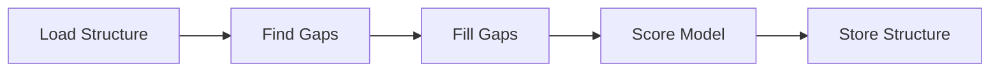

# Loop Modeller

Automated modelling missing loops in protein structures.

## Problem Statement

Protein structures often contain missing residues,
especially in flexible loop regions.

This project provides a Python-based solution for
identifying missing residues in protein structures
and producing a set of candidate structures where these
residues are added.

## Solution Strategy

The workflow is divided into the following steps:



1. Load structure: Load a structure with gaps from disk or the RCSB database.
2. Find gaps: Find gaps in the protein structure and
what residues are missing.
3. Fill gaps: Model missing residues into the protein structure.
  This is the computationally expensive part.
4. Score Structure: Measure the quality of the completed structure.

## Considerations

### Finding gaps

- Gaps can be identified by the amino acid residue number. Missing
  numbers indicate a gap. Alternatively, the structure residues can be
  aligned with the original amino acid sequence to find missing gaps.
- Protein structures often contain missing residues at both termini.
  These are not considered gaps . These parts of proteins are often unordered.
- If there are more than one chain, it is important to not consider
  that jumps in the amino acid numbering at these positions are not considered
  gaps.

### Loop Modelling

Loop modelling involves adding atoms of missing residues.
Various methods exist that use fragment libraries, ab initio modeling,
or machine learning based predictions.
Once initial coordinates for atoms are found,
the structure can be further optimized via energy minimization or
or moledular dynamics.

An overview of considered methods and libraries:

| Method/Library   | Note                                                                 |
| ---------------- | -------------------------------------------------------------------- |
| Modeller         | Produces good quality results. However, only available for academic users or a paid version. |
| Rosetta          | Good results. Widely used, but complicated to setup and use. |
| OpenMM/PDBFixer  | Freely available, Python-based, suitable for basic gap filling, not lots of parameter. |
| AlphaFold        | State-of-the-art. Computationally expensive. |

**Chosen method: OpenMM/PDBFixer** because it is freely available and can be implemented
without leaving the python ecosystem and installing external tools.

### Scoring

A scoring function should be able to assess the quality of the modelled structure
without being too expensive to calculate.

- Atom clash detection: Normalized count of clashing atoms.
A clash is defined as atoms getting closer than their combined
Van-der-Waals radius.
Can be done with numpy/scipy and is cheap to calculate.
However, does not provide information about structural
plausibility.
- Ramachandran plot analysis: Backbone dihedral angles analysis. Backbone dihedrals should fall well into the expected region for proteins.
  Good for backbone assessment, but ignores side chains.
- DOPE Score:  A statistical potential used by Modeller.
- Force field potential energy: Use a force field
and calculate the potential energy of the structure.
Expensive to calculate, but a good metric.

**Implemented scoring function:** Atom clash detection

Atom clash detection is used to assess the quality of the modelled structures.
While this is not a perfect scoring solution, but it is fast to calculate and easy to implement.
However, this scoring function is not sensitive to issues with bad geometry.
Ideally, this score should therefore be combined with additional
analysis like backbone dihedrals or potential energy.

## Installation and Usage

### Prerequisites

- Python 3.13
- A packagemanager (i.e. `uv`)

### Installation

Check out the repository and setup the environment.

```bash
git clone git@github.com:dnlbauer/loop-modelling.git
cd loop-modelling
uv venv
source .venv/bin/activate
uv sync
```

### CLI Interface

```bash
uv run lm <pdb id or mmcif file> <num models to produce>
```

- `<pdb id or mmcif file>`: The PDB ID or the path to an mmCIF file.
- `<num models to produce>`: The number of models to produce. Default is 1.

The tool creates a `metadata.json` file and the number of requested models
saved as `model_i.mmcif` where `i` is the model number.

The metadata file contains the scoring information for each model
and an overview over residues that were modelled.

## Examples

The examples folder shows the results of the modelling process for three proteins.
