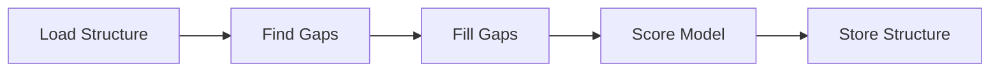

# Loop Modeller

Modelling missing loops in protein structures.

# Solution Strategy

Loop modelling for a protein can be separated in the following steps:

1. Load structure: Load a structure with gaps from disk or a database
2. Find gaps: Find gaps in the protein structure
3. Fill gaps: Model missing residues into the protein structure.
  This is the computationally expensive part.
4. Score Structure: Measure the quality of the completed structure.

## Considerations

#### Finding gaps

- Gaps can be identified by the amino acid residue number. Missing
  numbers indicate a gap. Alternatively, the structure residues can be
  aligned with the original amino acid sequence to find missing gaps.
- Protein structures often contain missing residues at both termini.
  These are not considered gaps . These parts of proteins are often unordered.
- If there are more than one chain, it is important to not consider
  that jumps in the amino acid numbering at these positions are not considered
  gaps.

### Loop Modelling

Loop modelling involves adding atoms of missing residues.
Various methods exist that use fragment libraries, ab initio modeling,
or machine learning based predictions.
Once initial coordinates for atoms are found,
the structure can be further optimized via energy minimization or
or moledular dynamics.

An overview of considered methods and libraries:

| Method/Library   | Note                                                                 |
| ---------------- | -------------------------------------------------------------------- |
| Modeller         | Produces good quality results. However, only available for academic users or a paid version. |
| Rosetta          | Good results. Widely used, but complicated to setup and use. |
| OpenMM/PDBFixer  | Freely available, Python-based, suitable for basic gap filling, not lots of parameter. |
| AlphaFold        | State-of-the-art. Computationally expensive. |

**Chosen method: OpenMM/PDBFixer** because it is freely available and can be implemented
without leaving the python ecosystem and installing external tools.

### Scoring

A scoring function should be able to assess the quality of the modelled structure
without being too expensive to calculate.

- Atom clash detection: Can be done with numpy and is cheap and easy to calculate.
- Ramachandran plot analysis: Analyse backbone dihedral angles. They should
  fall well into the expected region for proteins.
  Good for backbone assessment, but ignores side chains.
- DOPE Score:  A statistical potential used by Modeller.
- Force field potential energy: We could use any force field (ideally with implicit solvent),
  and calculate the potential energy of the structures.

**Implemented scoring function:** Atom clash detection

Atom clash detection is used to assess the quality of the modelled structures.
While this is not a perfect scoring function, it is fast to calculate and
easy to implement.
However, this scoring function is not sensitive to issues with the backbone (i.e. bad dihedrals).
Ideally, this should be combined with an analysis of the backbone dihedrals
or be replaced with a scoring function based on force field energy.
